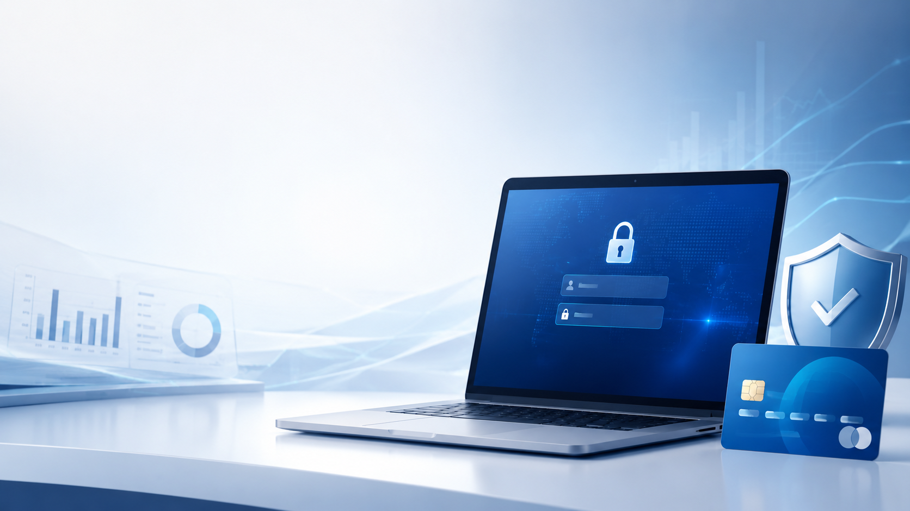
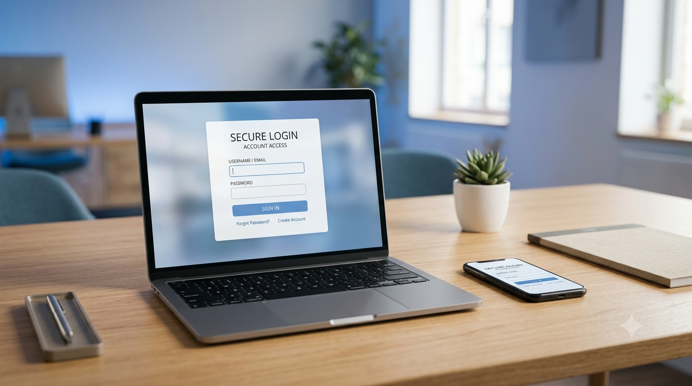

PC Mastercard Login: Sign In to Your Online Account
===================================================

Managing your credit card online is simple with **PC Mastercard Login**. After signing in to your account, you can view your balance, check recent transactions, make payments, download statements, update your personal information, and monitor your PC Optimum® points—all from one secure dashboard. Whether you're accessing your account from a computer or a mobile device, the online portal makes it easy to stay in control of your finances.

Sign In to Your PC Mastercard Account
-------------------------------------

Follow these steps to access your account:

#. Open the official PC Financial sign-in page.
#. Enter your **Username** or **Email Address**.
#. Type your **Password**.
#. Click **Sign In**.
#. Complete any security verification if prompted.

Once signed in, you'll have access to your account dashboard.

What You Can Do After Logging In
--------------------------------

.. image:: _static/account-dashboard.jpg
   :alt: PC Mastercard Account Dashboard
   :align: center
   :width: 700px

After logging in, you can:

* View your current balance and available credit.
* Check recent purchases and payment history.
* Make or schedule credit card payments.
* Download monthly statements.
* Update contact and security information.
* Monitor and redeem eligible PC Optimum® points.
* Set up account alerts and notifications.
* Report a lost or stolen card.

Forgot Your Password?
---------------------

.. image:: _static/reset-password.jpg
   :alt: Reset PC Mastercard Password
   :align: center
   :width: 700px

If you can't access your account:

* Select **Forgot Password** on the sign-in page.
* Enter your registered username or email.
* Verify your identity.
* Create a new password.
* Sign in again.

Common PC Mastercard Login Problems
-----------------------------------

.. image:: _static/login-error.jpg
   :alt: PC Mastercard Login Error
   :align: center
   :width: 700px

You may experience login issues for several reasons:

* Incorrect username or password.
* Expired or locked account credentials.
* Browser cache or cookies causing sign-in errors.
* Internet connection problems.
* Temporary website maintenance.

Clearing your browser cache, trying another browser, or resetting your password often resolves these issues.

Keep Your Account Secure
------------------------

.. image:: _static/account-security.jpg
   :alt: Secure PC Mastercard Account
   :align: center
   :width: 700px

To keep your account secure:

* Use a strong, unique password.
* Never share your login credentials.
* Sign out after using a public or shared computer.
* Enable available security features.
* Review your account activity regularly.

Frequently Asked Questions
--------------------------

Can I access my account on my phone?
^^^^^^^^^^^^^^^^^^^^^^^^^^^^^^^^^^^^

Yes. You can sign in using a mobile browser or the official mobile app, if available.

Can I make payments online?
^^^^^^^^^^^^^^^^^^^^^^^^^^^

Yes. Eligible payments can be made after signing in.

What should I do if my account is locked?
^^^^^^^^^^^^^^^^^^^^^^^^^^^^^^^^^^^^^^^^^

Use the password recovery option or contact customer support.

Conclusion
----------

.. image:: _static/pc-mastercard-conclusion.jpg
   :alt: PC Mastercard Online Account
   :align: center
   :width: 700px

The **PC Mastercard Login** portal provides a secure and convenient way to manage your credit card account online. By signing in regularly, you can monitor your balance, review transactions, make payments, track your rewards, and keep your account information up to date.
